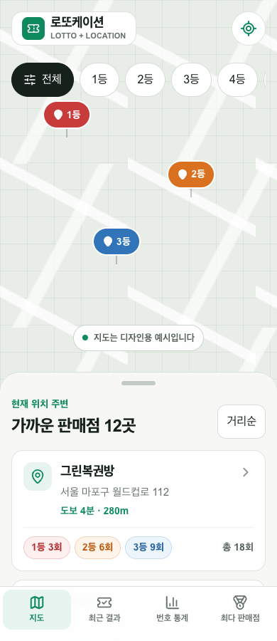
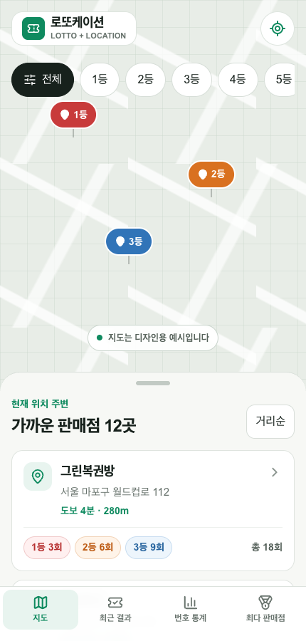
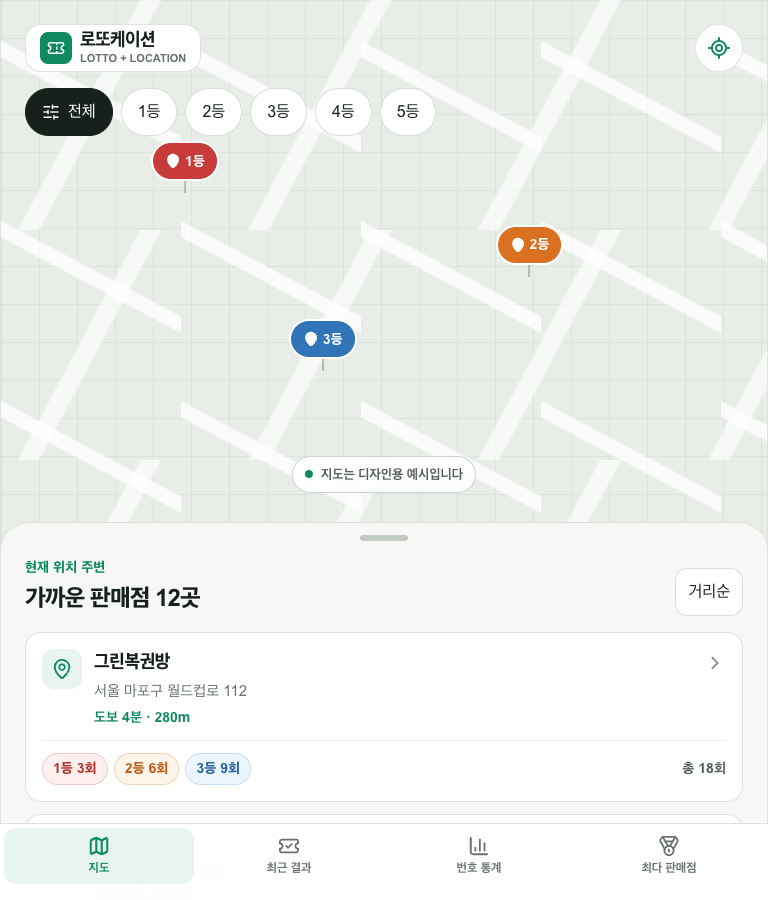

# 로또케이션 (LottoCation)

> 가까운 로또 판매점과 과거 당첨 이력을 쉽게 찾는 모바일 웹

30대 이상 사용자를 위한 모바일 우선 로또 판매점 탐색 서비스다. 현재 앱은 **1차 디자인 목업**으로, API·DB·인증·결제·지도 연동 없이 정적 목업 데이터만 사용한다.

- Git: https://github.com/YangSaekyul/lotto-cation
- Project URL: 미배포
- Product plan: [`PRODUCT_PLAN.md`](./PRODUCT_PLAN.md)

## 실행

```bash
npm install
npm run dev
```

품질 검증:

```bash
npm run lint
npm run build
```

## 구현 화면

| 경로 | 화면 |
| --- | --- |
| `/` | 지도 placeholder, 등수 필터, 현재 위치 버튼, 판매점 바텀시트 |
| `/store/green-lottery` | 판매점 정보, 과거 이력, 길찾기·제보 버튼 |
| `/draw/latest` | 직전 회차 번호와 1~5등 당첨자 수 |
| `/stats` | 기간 탭과 1~45 번호 빈도 그리드 |
| `/stores/ranking` | 당첨 이력 탭, 지역 필터, 판매점 순위 |
| `/report` | 폐점·이전·주소 오류 제보 폼 목업 |

공통 UI는 `components/`, 데이터 타입과 목업 값은 `lib/mock-data.ts`에 분리했다. 후속 개발에서는 이 데이터 경계만 실제 조회 결과로 교체할 수 있다.

## 모바일 검증 스크린샷

2026-08-01 기준, 6개 화면을 360px·390px·430px·768px에서 확인했다. 모든 조합에서 문서 `scrollWidth`와 `clientWidth`가 같았고 오류 오버레이 및 브라우저 콘솔 오류가 없었다.

| 360px | 390px |
| --- | --- |
|  |  |

| 430px | 768px |
| --- | --- |
|  |  |

검증 결과:

- `npm run lint`: 통과, 경고 0건
- `npm run build`: 통과, 6개 요구 화면 생성 확인
- 반응형 overflow: 24개 조합 모두 없음
- 외부 API·환경변수·지도 키·결제 SDK: 사용하지 않음

## 데이터 상태

- Legacy historical store data: 1·2등 이력 51,456건, 1168회까지 보존
- Official refresh: 1169~1234회 결과 66회 및 1~5등 판매점 28,136건 수집
- Latest verified completed draw: 1234회 (2026-07-25)

위 파일은 이번 디자인 목업에 연결하지 않았다. 과거 당첨 이력과 번호 통계는 향후 당첨 확률을 높이지 않는다.

## 후속 데이터 작업

1. legacy 1·2등 이력과 official 1169~1234회 1~5등 이력을 정규화·병합한다.
2. 기존 14,079개 주소 중 좌표가 없는 과거 판매점을 지오코딩한다.
3. 최신 회차와 판매점 이력을 주기적으로 갱신하는 작업을 만든다.

동행복권과 무관한 정보 서비스다.
